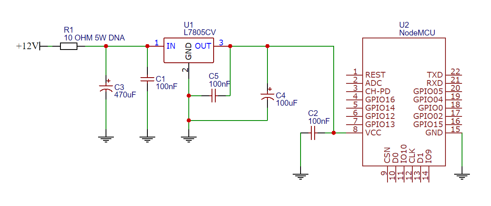
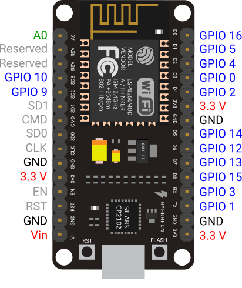
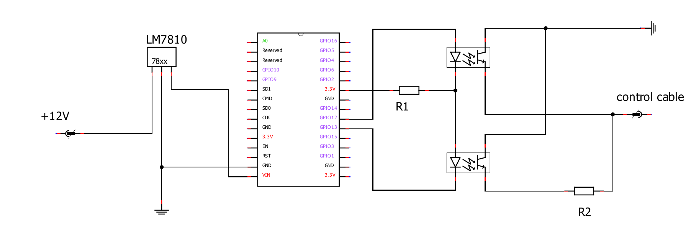

# Locky
> Open your car with phone! 

   

Microcontroller program to interact with car central locking system with a mobile phone application.
the mobile application is written in a flutter, and the microcontroller program in c ++ with the use of network libraries.

### Notice
This repository don't contains mobile app due to accidental deletion.

## Supported car central locking system
#
- Mazda 323F BJ, nadec (BJ3F67830B)
 
>If your car or door driver is not listed, please please open an issue with your central locking model. 

## Supported microcontrolers
#
- NodeMCU
- Arduino + WiFi Module
- ESP8266
- ESP-01

>If your microcontroller is not supported, please open an issue. I'll try do my best do make it compatible with my software.

## Used electronics components
#

To properly build this project, you should have the following components:

#### Power supply

- Voltage stabilizer (LM7810), but you can use any power source that suits your microcontroller  
- 10Ohm 5W resistor
- 1x 470uF capacitor
- 3x 100nF capacitor
- 1x 100uF capacitor
- Universal PCB

### Control
- microcontroler (see 'Supported microcontrolers' section)
- 1x 2-Channel 12V Relay module (JQC-3FF-S-Z)
- 1x 1k Ohm resistor
- A couple of wires

## Construction manual 
#

To build this project, I used a NodeMCU microcontroller, the pinout diagram can be seen in the picture below

The outgoing signals to control the car's lock controller are 12 and 13, pin 12 is used to open, 13 to close the car door. On the microcontroller board these are the pins marked with the numbers D6 (12), D7 (13) 

#

Connect all components as shown in the scheme above, make sure that the connections are solid and properly soldered. 

>To connect the set to my car, I used 4 T-type quick couplers, 2 to connect the microcontroller power supply, 2 to connect to the central locking control cable. 

## Tech
#
Locky uses a number of open source projects to work properly:
- [Flutter] - Mobile application framework
- [ESPAsyncWebServer] - Async HTTP and WebSocket Server for ESP Arduino
- C++ 

